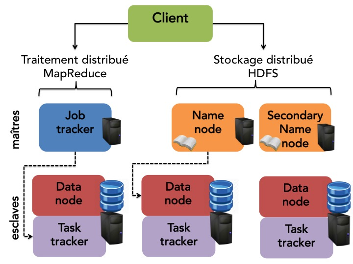

# BDA-tortoises-races

### Membres du groupe : 

- SBAAI Abdelaziz, p1807434
- BOUGE Yoann, p1711842
- BEVERAGGI Jean, p1809133
- DAO AN HANH, p2110970


Les programmes de récupération des données et d'analyse sont sur le compte d'Abdelaziz : 
> `ssh -i cle.ssh p1807434@192.168.76.161`


### Comment utiliser nos prgrammes 

- TODO liste des commandes 


## Récupération des données

Pour la récuperation de données nous utilisons un programme Python avec la librairie **requests** pour requêter le serveur. 

### Script de récupération

La script Python [recuperation2.py](./recuperation2.py) va requêter le serveur toutes les 2 secondes pour éviter de manquer des *tops* et va ignorer les doublons. Si la nouvelle donnée sur la course possède le même *top* que la dernière enregistrée, alors elle est ignoré. 

La fonction **getData** de notre script de récupération de données prend 3 paramètres : 
- La taille de la course sur laquelle on veut récuperer les données. `{tiny, small, medium, large}`
- Le répertoire dans lequelle on veut enregistrer les données. `Par défaut : "./data"`  
- Le nombre de ligne que l'on veut enregistrer par fichier. `Par défaut : 1000`

> Remarque : Les fichiers csv ne sont écrit que lorsque le bon nombre donnée à été récupéré. _Exemple : Si le nombre de ligne par fichier est configuré sur 1000, les fichiers csv seront créés une fois qu'on aura récupéré 1000 tops._

Au lancement du programme, nous allons créer dans le répertoire *./data/{taille_course}/*, un répertoire pour chaque tortue. Chaque dossier portera comme nom l'identifiant de la tortue qu'il représente. Dans chaque dossier associé à une tortue nous allons créer et remplir des fichiers csv au cours de l'éxecution du programme. Chaque csv contiendra par défaut 1000 top d'une tortue.

Les fichiers seront composé dans attributs suivant : `top | id | position | vitesse | qualite | temperature `, où la vitesse est la différence entre la position de la tortue au top précedent et le top actuel. 

Un exemple pour la tortue 0 de la course tiny: 
```csv
top,id,position,vitesse,qualite,temperature 
794399,0,66729516,84,0.3100529516794682,4.431087398824114
794400,0,66729600,84,0.3100529516794682,4.431087398824114
794401,0,66729684,84,0.3100529516794682,4.431087398824114
794402,0,66729768,84,0.3100529516794682,4.431087398824114
794403,0,66729852,84,0.3100529516794682,4.431087398824114
794404,0,66729936,84,0.3100529516794682,4.431087398824114
...
```
On peut supposer que cette tortue est régulière car sa vitesse ne change pas. 

Un exemple pour la tortue 17 de la course small: 
```csv
top,id,position,vitesse,qualite,temperature
...
804871,17,129987328,63,0.48688447869248985,-4.201155048069171
804872,17,129987378,50,0.48688447869248985,-4.201155048069171
804873,17,129987415,37,0.48688447869248985,-4.201155048069171
804874,17,129987439,24,0.48688447869248985,-4.201155048069171
804875,17,129987450,11,0.48688447869248985,-4.201155048069171
804876,17,129987450,0,0.48688447869248985,-4.201155048069171
804877,17,129987463,13,0.48688447869248985,-4.201155048069171
804878,17,129987489,26,0.48688447869248985,-4.201155048069171
804879,17,129987528,39,0.48688447869248985,-4.201155048069171
804880,17,129987580,52,0.48688447869248985,-4.201155048069171
804881,17,129987645,65,0.48688447869248985,-4.201155048069171  
...
```
On peut supposer que celle-ci est fatigué car sa vitesse diminue jusqu'à atteindre 0 puis re-accélère. 

### Copie sur HDFS 

Pour affectuer nos traitements d'analyses nous allons avoir besoins d'un systeme de traitement distribuée pour gérer et analyser nos grandes quantité de données.
Nous allons utiliser HDFS pour sauvegarder nos données de façon distribué. Par la suite nous pourrons appliquer un traitement distribué pour rendre notre analyse bien plus efficace et rapide.



Pour cela nous allons copier nos données sur un cluster HDFS toutes les 12h. Nous utilisons **cron** pour executer la commande *hdfs* automatiquement tout les *x* temps :

- `commande cron hdsf` //TODO

## Analyse  des données 


